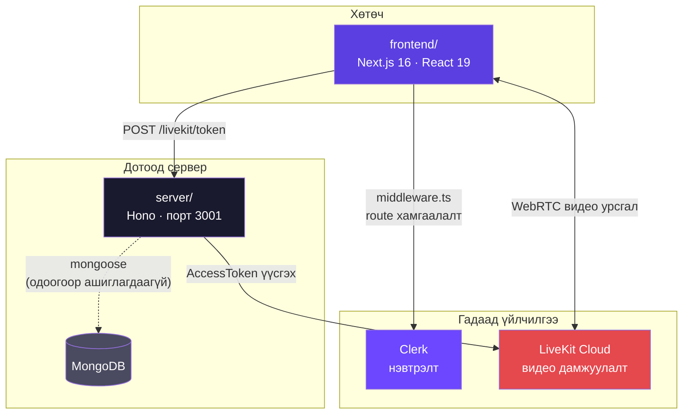
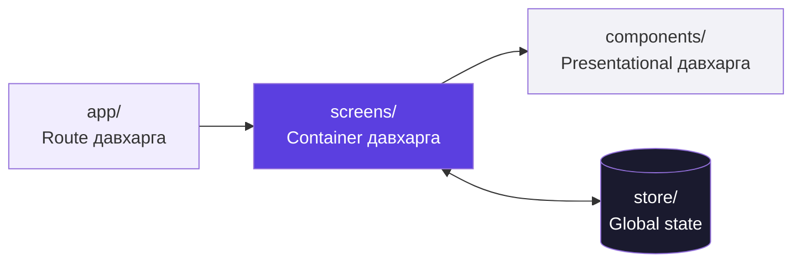
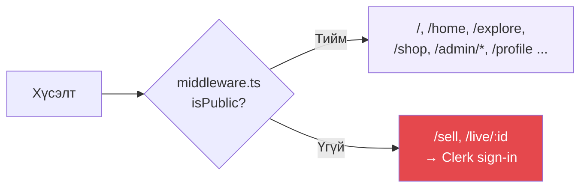
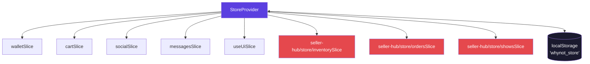
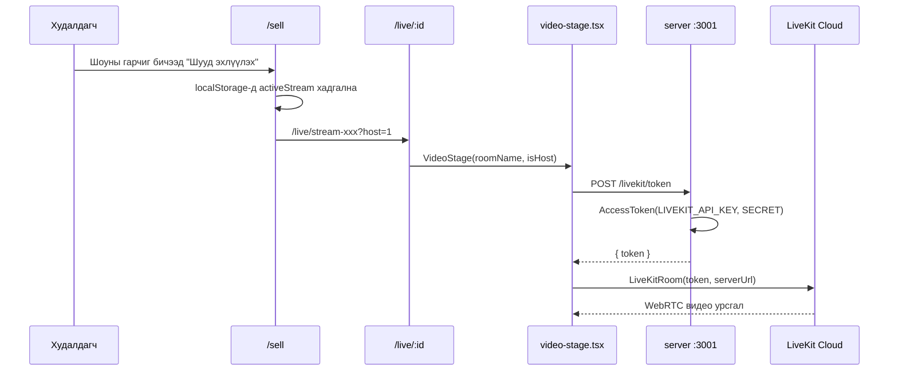

# WhyNot — Системийн архитектур

Шууд дамжуулалттай дуудлага худалдааны платформ. Энэ баримт нь кодын бүх хэсэг
хоорондоо хэрхэн холбогддогийг тайлбарлана.

---

## 1. Ерөнхий тойм

Repo-д гурван бие даасан хэсэг байна:

```
team-project/
├── frontend/    Next.js 16 вэб апп       (порт 3000)
├── server/      Hono API + MongoDB       (порт 3001)
└── expo-app/    React Native мобайл апп  (тусдаа)
```



### Одоогийн бодит байдал — үүнийг эхлээд ойлгох нь чухал

| Хэсэг | Төлөв |
|---|---|
| **Clerk нэвтрэлт** | ✅ Бодитоор ажиллаж байна |
| **LiveKit дамжуулалт** | ✅ Бодитоор ажиллаж байна (`/sell` → `/live/[id]`) |
| **Бусад бүх дэлгэц** | ⚠️ **Mock өгөгдөл** — `frontend/data/` + localStorage |
| **MongoDB / API route-ууд** | ⚠️ Код бичигдсэн ч **mount хийгдээгүй** |

`server/src/index.ts` дотор зөвхөн `/livekit` л холбогдсон:

```ts
app.use("/livekit/*", cors({ origin: "http://localhost:3000" }));
app.route("/livekit", livekit);   // ← ганц идэвхтэй route
```

`server/src/route/` доторх бусад 12 файл (product, order, bid, wallet...) бичигдсэн
боловч `app.route(...)`-оор холбогдоогүй тул одоогоор дуудагдахгүй.

Frontend-ээс backend руу явдаг **цорын ганц** хүсэлт:

```
components/live/video-stage.tsx:49
  POST http://localhost:3001/livekit/token
```

---

## 2. Портын зураглал

| Порт | Юу | Асаах |
|---|---|---|
| 3000 | frontend | `cd frontend && npm run dev` |
| 3001 | backend | `cd server && npm run dev` |

⚠️ Frontend **заавал 3000** дээр байх ёстой. Учир нь `server/src/index.ts` дотор CORS
нь `http://localhost:3000`-г л зөвшөөрдөг. Өөр порт дээр асаавал LiveKit token авахад
CORS алдаа гарна.

---

## 3. Frontend — гурван давхарга



**Гол дүрэм:** `useStore()`-г **зөвхөн container давхарга** дуудна. Presentational
компонентууд зөвхөн props авдаг тул тусад нь турших, дахин ашиглахад амархан.

Жишээ урсгал:

```
app/(shop)/admin/orders/page.tsx          route бүрхүүл, Suspense
  └── features/seller-hub/screens/SellerOrders.tsx     useStore() ← ГАНЦ холбоос
        ├── components/PageHeader.tsx                  props: { title, description }
        ├── components/FilterTabs.tsx                  props: { tabs, active, onChange }
        └── components/orders/OrdersTable.tsx          props: { orders, onSelect }
```

---

## 4. Route бүтэц (`frontend/app/`)

Next.js App Router. Хаалтанд байгаа нэр (`(shop)`) нь URL-д ордоггүй, зөвхөн
бүлэглэх зориулалттай.

```
app/
├── layout.tsx                    ClerkProvider + фонт + globals.css  ← root
├── sign-in/[[...sign-in]]/       Clerk-ийн нэвтрэх дэлгэц
├── sign-up/[[...sign-up]]/       Clerk-ийн бүртгүүлэх дэлгэц
│
├── (shop)/                       ХУДАЛДАН АВАГЧ + SELLER HUB
│   ├── layout.tsx                → AppShell
│   ├── page.tsx                  /            нүүр
│   ├── home/                     /home        фийд
│   ├── explore/                  /explore     ангилал хайх
│   ├── live-show/                /live-show   шоу үзэх (reel)
│   ├── shop/                     /shop        дэлгүүрийн хуудас
│   ├── product/                  /product     барааны дэлгэрэнгүй
│   ├── profile/                  /profile     хувийн мэдээлэл
│   ├── messages/                 /messages    чат
│   ├── wallet/                   /wallet      хэтэвч
│   └── admin/                    /admin/*     ← SELLER HUB (9 хуудас)
│
└── (broadcast)/                  ЖИНХЭНЭ LIVEKIT УРСГАЛ
    ├── layout.tsx                → AppShell
    ├── sell/                     /sell        шоу эхлүүлэх
    ├── sell/onboarding/          /sell/onboarding  худалдагч болох
    └── live/[id]/                /live/:id    дамжуулалтын өрөө
```

### Route хамгаалалт (`middleware.ts`)



`(shop)` доторх бүх зүйл mock өгөгдөл дээр ажилладаг тул нээлттэй — статик demo-гийн
өмнө нэвтрэлт тавих нь утгагүй. Clerk нь **жинхэнэ** функц болох `(broadcast)`-ыг л
хамгаална.

---

## 5. State удирдлага (`frontend/store/`)

localStorage-д хадгалагддаг, Context дээр суурилсан энгийн store. Redux биш.

```
store/
├── StoreProvider.tsx    Бүх slice-ийг угсарна, localStorage-той sync хийнэ
├── useStore.ts          useContext хийх hook
├── state.ts             defaultState, loadState, persistState, makeId, parsePrice
├── types.ts             Slice-үүдийн TypeScript interface
└── slices/
    ├── walletSlice.ts     credits, topUp, buy, bid
    ├── cartSlice.ts       сагс: нэмэх, тоо солих, checkout
    ├── socialSlice.ts     дагах / дагахаа болих
    ├── messagesSlice.ts   чат thread, уншсан тэмдэглэх, илгээх
    └── useUiSlice.ts      modal нээх/хаах, toast мэдэгдэл
```

Seller Hub-ын гурван slice (`inventory`, `orders`, `shows`) нь **тэр feature-т**
байрладаг — доороос үзнэ үү.



**Hydration-ы анхаарах зүйл:** `StoreProvider` нь localStorage-г `useState`-ийн
эхний утгад биш, mount хийсний **дараа** уншдаг. Ингэснээр server render болон
client-ийн эхний render таарна.

---

## 6. Худалдан авагчийн тал — компонент бүрээр

### `components/layout/` — бүх дэлгэцийн бүрхүүл

| Файл | Үүрэг |
|---|---|
| `AppShell.tsx` | `whynot-root` + `StoreProvider` + Topbar + Modal + Toast. `/admin` дээр Topbar-г нуудаг (Seller Hub өөрийн sidebar-тай) |
| `Topbar.tsx` | Дээд самбар: nav + хайлт + үйлдлүүд. `useStore()`-оос credits/cart/unread авна |
| `TopbarNav.tsx` | Home / Explore / Browse холбоосууд |
| `TopbarActions.tsx` | "Become a Seller", зүрх, чат, хонх, хэтэвч, сагс, профайл |

### `components/screens/` — container давхарга (8 дэлгэц)

Эдгээр нь `useStore()` дуудаж, доорх компонентуудад props тараадаг.

| Файл | Route | Юу харуулдаг |
|---|---|---|
| `Home.tsx` | `/home` | Хувийн фийд |
| `Explore.tsx` | `/explore` | Ангилал, тренд бараа |
| `LiveShow.tsx` | `/live-show` | Reel хэлбэрийн шоу үзэх |
| `Shop.tsx` | `/shop` | Худалдагчийн дэлгүүр |
| `Product.tsx` | `/product` | Барааны дэлгэрэнгүй |
| `Profile.tsx` | `/profile` | Хэрэглэгчийн профайл |
| `Messages.tsx` | `/messages` | Чат |
| `Wallet.tsx` | `/wallet` | Хэтэвч, гүйлгээ |

### Presentational компонентууд

**`components/home/` (6)** — нүүр фийд
`HomeFeedHeader` гарчиг · `HomeSidebar` зүүн самбар · `FeaturedShow` онцлох шоу
`ShowGrid` сүлжээ · `CategorySection` ангиллын хэсэг · `SellerRow` худалдагчийн мөр

**`components/explore/` (5)** — хайх, нээх
`ExploreHeader` · `CategoryGrid` ангиллын сүлжээ · `ExploreSection` хэсэг
`TrendingProducts` тренд бараа · `UpcomingShows` товлосон шоу

**`components/liveshow/` (6)** — шоу үзэх дэлгэц
`ReelStage` видео тайз · `ReelNavRail` дээш/доош шилжих · `ReelItemBar` доод мөр
`ChatPanel` чат · `ShowInfoPanel` шоуны мэдээлэл · `ShowProductList` барааны жагсаалт

**`components/product/` (4)** — барааны хуудас
`ProductGallery` зураг · `ProductBuyPanel` худалдан авах самбар
`ProductActions` үйлдэл · `QuantityStepper` тоо ширхэг

**`components/shop/` (3)** — дэлгүүрийн хуудас
`ShopHeader` · `ShopStats` статистик · `ShopTabs` таб

**`components/profile/` (8)** — профайлын табууд
`ProfileSidebar` · `OverviewTab` · `PurchasesTab` худалдан авалт · `SavedTab` хадгалсан
`FollowingTab` дагаж буй · `AddressesTab` хаяг · `PaymentTab` төлбөр · `SettingsTab` тохиргоо

**`components/messages/` (2)** — `ThreadList` яриануудын жагсаалт · `ChatView` чат цонх

**`components/wallet/` (3)** — `BalanceCard` үлдэгдэл · `TopUpPanel` цэнэглэх · `TransactionList` гүйлгээ

**`components/reviews/` (2)** — `ReviewSummary` дүгнэлт · `ReviewList` сэтгэгдлүүд

**`components/cards/` (2)** — хуваалцсан карт: `ShowCard` шоу · `ProductCard` бараа

**`components/modals/` (9)** — modal систем
`ModalsRenderer` аль modal нээхийг `useUiSlice`-аас уншиж шийднэ
`BuyModal` худалдан авах · `BidModal` үнэ хаях · `CartModal` сагс · `GiveawayModal` бэлэг
`CartLineRow` / `CartStaticRow` сагсны мөр · `BalanceSummary` үлдэгдэл · `ModalActionButton` товч

**`components/ui/` (5)** — үндсэн примитив
`Avatar` · `LiveDot` улаан цэг · `Modal` бүрхүүл · `ToastContainer` мэдэгдэл · `button` (shadcn)

**`components/live/` (1)** — `video-stage.tsx` ← **LiveKit-ийн цорын ганц газар**

### `hooks/` — худалдан авагчийн талын логик

| Hook | Үүрэг |
|---|---|
| `useHomeFeed.ts` | Фийдийн хайлт, ангилал шүүх, хуудаслалт |
| `useExploreFeed.ts` | Explore хуудасны өгөгдөл бэлдэх |
| `useReelPlayer.ts` | Reel тоглуулагч: countdown, үзэгчид, чат мөр |

### `data/` — mock өгөгдөл

`homeShows.ts` · `reelShows.ts` · `sellers.ts` · `exploreCategories.ts` · `seedUser.ts`

---

## 7. Seller Hub (`frontend/features/seller-hub/`)

Худалдагчийн самбар. **Бүх код нэг фолдерт** — 64 файл. URL нь `/admin/*`.

```
features/seller-hub/
├── README.md       Дэлгэрэнгүй дүрэм
├── index.ts        Public surface — ЗӨВХӨН screen-үүд export хийнэ
├── types.ts        SellerOrder, SellerShow, InventoryProduct, ShowProduct
├── screens/   (7)  Container — useStore() дуудна
├── components/(47) Presentational — ЗӨВХӨН props
├── hooks/     (2)  useSellerOverview, useSellerAnalytics
├── data/      (4)  seed өгөгдөл
└── store/     (3)  inventorySlice, ordersSlice, showsSlice
```

### Screens (7)

| Файл | Route | Юу хийдэг |
|---|---|---|
| `SellerHubLayout.tsx` | бүх `/admin/*` | Sidebar + Topbar бүрхүүл, хүлээгдэж буй захиалгын тоо |
| `SellerOverview.tsx` | `/admin` | Орлого, биелүүлэх захиалга, дуусаж буй бараа, дараагийн шоу |
| `SellerOrders.tsx` | `/admin/orders` | Захиалгын жагсаалт + дэлгэрэнгүй, статус ахиулах |
| `SellerProducts.tsx` | `/admin/products` | Бараа материал, бөөнөөр үйлдэл, нөөц засах |
| `SellerShows.tsx` | `/admin/shows` | Шоу үүсгэх, товлох, бараа хавсаргах, **Go Live товч** |
| `SellerAnalytics.tsx` | `/admin/analytics` | Борлуулалтын график (recharts), шилдэг бараа |
| `SellerSettings.tsx` | `/admin/settings` | Баталгаажуулалт, төлбөр тооцоо |

### Components (47) — дэд бүлгүүд

| Фолдер | Тоо | Агуулга |
|---|---|---|
| (үндсэн) | 9 | `SellerSidebar` `SellerTopbar` `SellerSearchField` `PageHeader` `KpiCard` `DataCard` `FilterTabs` `FormField` `StatusPill` + `statusTones.ts` |
| `overview/` | 7 | `LiveShowBanner` `NextShowBanner` `QuickActions` `ActionRequired` `ActionCard` `ShowListSection` `LastShowPerformance` |
| `orders/` | 7 | `OrdersTable` `OrderDetail` `OrderItemsCard` `OrderPaymentCard` `CustomerPanel` `FulfillmentPanel` `ShippingForm` |
| `products/` | 8 | `InventoryTable` `InventoryRow` `ProductForm` `ProductMediaCard` `ProductPricingCard` `StockModal` `BulkActionBar` + `productDraft.ts` |
| `shows/` | 7 | `ShowsTable` `ShowDetail` `ShowForm` `ShowProductsCard` `ShowStatsPanel` `ShowStatusPanel` `InventoryPickerModal` |
| `analytics/` | 5 | `SalesChart` `TopProductsTable` `ShowPerformanceTable` `InsightPanel` `AnalyticsTableCard` |
| `settings/` | 3 | `SettingsNav` `VerificationPanel` `PayoutsPanel` |

### Global store-той холбоо

Гурван slice нь энэ feature-т харьяалагдана. `StoreProvider` зөвхөн угсардаг:

| Хэрэглэгч | Хаанаас |
|---|---|
| `store/StoreProvider.tsx` | `@/features/seller-hub/store/*` |
| `store/state.ts` | `@/features/seller-hub/data/seed*` |
| `store/types.ts`, `types/store.ts` | `@/features/seller-hub/types` |

Эдгээр нь `index.ts` barrel-аар **биш**, шууд leaf зам руу заадаг — barrel нь
`"use client"` screen export хийдэг тул зөвхөн төрөл авах import серверийн модуль
граф руу компонент чирч оруулахаас сэргийлсэн.

---

## 8. LiveKit — жинхэнэ шууд дамжуулалт

**Seller Hub-д хамаарахгүй.** `features/seller-hub/components/shows/ShowStatusPanel.tsx`
дээрх "Go Live Now" товч нь LiveKit дуудахгүй — зөвхөн mock статусыг `LIVE` болгоно.

Бодит урсгал:



**Оролцох файлууд:**

| Файл | Үүрэг |
|---|---|
| `app/(broadcast)/sell/page.tsx` | Шоу эхлүүлэх, `useSyncExternalStore`-оор localStorage уншина |
| `app/(broadcast)/sell/onboarding/page.tsx` | Худалдагч болох хүсэлт |
| `app/(broadcast)/live/[id]/page.tsx` | Өрөөний хуудас |
| `components/live/video-stage.tsx` | LiveKit room, token авах, камер/микрофон |
| `server/src/livekit.ts` | `POST /token` — AccessToken үүсгэнэ |

`sell/page.tsx` нь `useSyncExternalStore` ашигладаг: localStorage бол external store
тул effect дотор `setState` дуудахгүйгээр SSR/hydration-г зөв зохицуулна.

**Seller Hub → LiveKit гүүр:** `/admin/shows` дээрх "Go Live" товч нь `/sell` рүү
заана. Энэ бол хоёр системийг холбож буй цорын ганц цэг.

---

## 9. Backend (`server/`)

Hono framework, порт 3001, MongoDB (mongoose).

```
server/src/
├── index.ts        Апп угсрах, CORS, порт 3001
├── livekit.ts      ✅ ИДЭВХТЭЙ — POST /livekit/token
├── route/     (12) ⚠️ бичигдсэн ч mount хийгдээгүй
├── controllers/(12) ⚠️ дээрхтэй адил
└── models/    (12) MongoDB schema
```

**Models:** `User` `Product` `ProductListing` `Category` `Order` `Bid` `Wallet`
`Cointransaction` `Live_show` `Show_product` `Video` `Video_product`

Route-уудыг идэвхжүүлэхийн тулд `index.ts` дотор `app.route("/products", productRoute)`
гэх мэтээр нэмэх шаардлагатай.

---

## 10. Гол дүрмүүд

1. **`useStore()`-г зөвхөн container (screens) давхарга дуудна.** Presentational
   компонент store-д хүрвэл давхаргын хил алдагдана.

2. **Seller Hub бол хаалттай модуль.** Гаднаас зөвхөн `features/seller-hub` barrel-аар
   ханд. `components/`, `hooks/`, `data/` дотор нь шууд ороход хил алдагдана.

3. **Frontend заавал порт 3000.** Backend-ийн CORS үүнийг л зөвшөөрдөг.

4. **Design token `--wn-` угтвартай.** `app/globals.css` доторх `.whynot-root` дотор
   scope хийгдсэн — LiveKit-ийн түшиглэдэг shadcn token-уудтай мөргөлдөхөөс сэргийлсэн.

5. **Route файлууд логик агуулахгүй.** Зөвхөн `Suspense` + screen render.

6. **Дэлгэц бүр mock өгөгдөл дээр ажилладаг** (LiveKit-ээс бусад). Backend холбохдоо
   container давхаргыг л засна — presentational компонентууд хөндөгдөхгүй.

---

## 11. Мэдэгдэж буй асуудлууд

| Асуудал | Хаана | Тайлбар |
|---|---|---|
| Analytics бүх утга ₮0 | `/admin/analytics` | Seed захиалгын огноо 2023 он, "Last 30 days" шүүлтэд таарахгүй |
| Hydration алдаа | `/admin/shows` | `seedShows.ts` дэх `scheduledAt` нь import үед `Date.now()`-оос тооцогддог тул server/client зөрнө |
| Lint 9 warning | `hooks/`, `store/` | `eslint.config.mjs` дээр зориудаар downgrade хийсэн — ported кодыг эх сурвалжтай нь diff хийхэд амар байлгах үүднээс |
